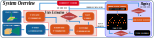

## FAST-LIO
**FAST-LIO** (Fast LiDAR-Inertial Odometry) is a computationally efficient and robust LiDAR-inertial odometry package. It fuses LiDAR feature points with IMU data using a tightly-coupled iterated extended Kalman filter to allow robust navigation in fast-motion, noisy or cluttered environments where degeneration occurs. Our package address many key issues:
1. Fast iterated Kalman filter for odometry optimization;
2. Automaticaly initialized at most steady environments;
3. Parallel KD-Tree Search to decrease the computation;

## FAST-LIO 2.0 

**Pipeline:**
<div align="center">

</div>

**New Features:**
1. Incremental mapping using [ikd-Tree](https://github.com/hku-mars/ikd-Tree), achieve faster speed and over 100Hz LiDAR rate.
2. Direct odometry (scan to map) on Raw LiDAR points (feature extraction can be disabled), achieving better accuracy.
3. Since no requirements for feature extraction, FAST-LIO2 can support many types of LiDAR including spinning (Velodyne, Ouster) and solid-state (Livox Avia, Horizon, MID-70) LiDARs, and can be easily extended to support more LiDARs.
4. Support external IMU.
5. Support ARM-based platforms including Khadas VIM3, Nivida TX2, Raspberry Pi 4B(8G RAM).

**Related papers**: 

[FAST-LIO2: Fast Direct LiDAR-inertial Odometry](doc/Fast_LIO_2.pdf)

[FAST-LIO: A Fast, Robust LiDAR-inertial Odometry Package by Tightly-Coupled Iterated Kalman Filter](https://arxiv.org/abs/2010.08196)


## Quickly Run with Zvision_1/3/5/5_MT

**For ROS2 Users**: Please switch to the **ros2** branch and follow the instructions at [ros2 branch (main) ](https://github.com/ZVISION-lidar/FAST_LIO_ZVISION.git)

## 1. Prerequisites
### 1.1 **Ubuntu** and **ROS**
**Ubuntu >= 18.04**

The **default from apt** PCL and Eigen is enough for FAST-LIO to work normally.

ROS >= melodic (Recommend to use ROS-Noetic). 

### 1.2. **PCL && Eigen**
PCL    >= 1.8,   Follow [PCL Installation](https://pointclouds.org/downloads/#linux).

Eigen  >= 3.3.4, Follow [Eigen Installation](http://eigen.tuxfamily.org/index.php?title=Main_Page).


## 2. Build
Clone the repository and colcon build:

```bash
    cd <ros1_ws>/src # cd into a ros1 workspace folder
    git clone -b ROS1 https://github.com/ZVISION-lidar/FAST_LIO_ZVISION.git
    git pull
    cd ..
    catkin_make
```


## 3. Directly run with zvision

### 3.1 Run use ros launch

Launch zvision ros driver.

```bash
cd <yourself_zvision_ros_driver_ws>
source devel/setup.bash # use setup.zsh if use zsh
roslaunch zvlidar_sdk run.launch
```


Launch fastlio2.
```bash
cd <ros1_ws>
source devel/setup.bash # use setup.zsh if use zsh
roslaunch fast_lio mapping_zvision_nz1.launch # depend on yourself lidar model: roslaunch fast_lio mapping_zvision_nz*(1/3/5/5_mt).launch.py 
```


### 3.2 PCD file save

Enable `pcd_save.pcd_save_en` in the config file and set the `map_file_path` to the path where the map will be saved.

```pcl_viewer scans.pcd``` can visualize the point clouds.
